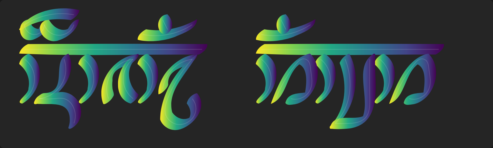

# metafont-splines

TODO:
- rewrite to take only 1 list of knots rather than list of lists of knots
- add type annotations
- fit beziers to outline
- write a function returning path d cubic beziers string
- render to SVG
- add paths for SVG animation
- extend visualization to allow multiple curves
- add rewriting system using JSON file with definitions of letters
